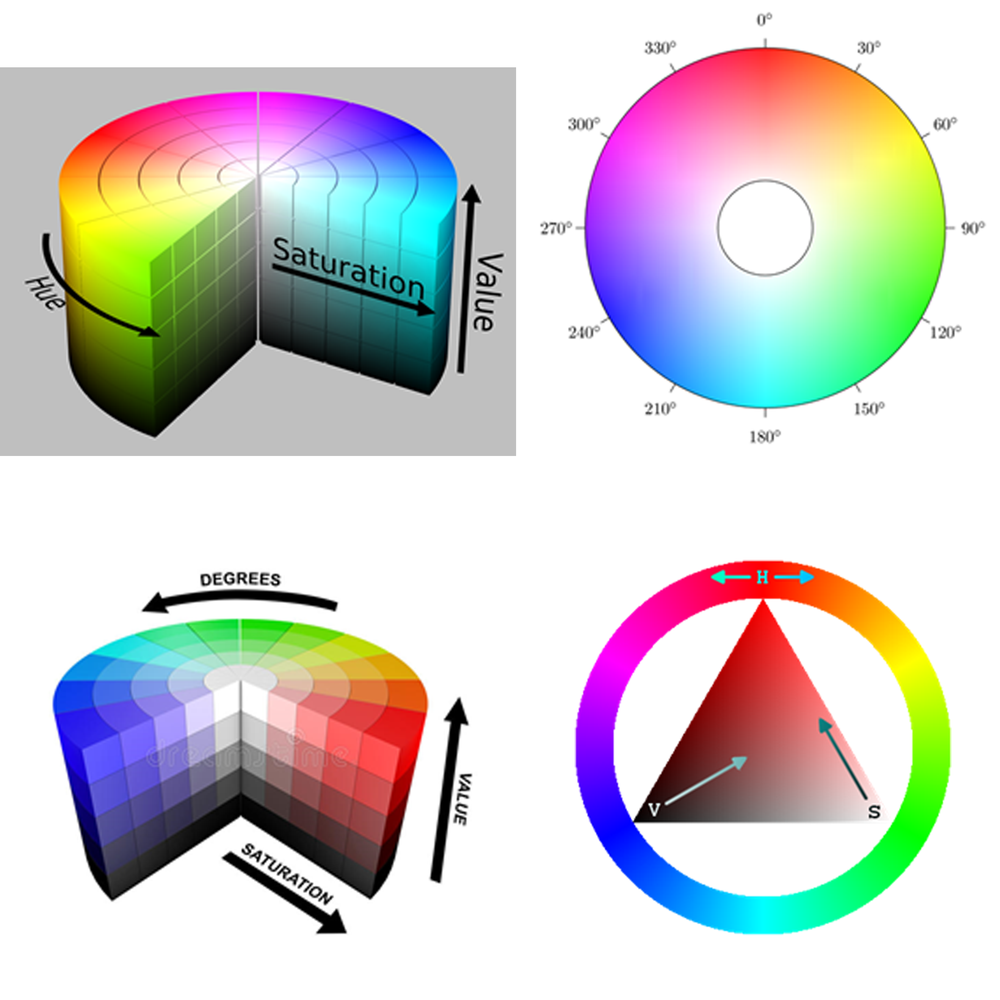

# Image Colour Sorter
Ava Bake

This code creates a simple straight forward way to carry out basic colour recognition that ordered images depending on their colours present. If you were to push on one of the buttons that are labelled as a colour the images will be organised with the images with the most of those pixels of that colour showed first and then the least shown last. Then the final button of rainbow takes the most prominent colour from each image the orders them in the hue spectrum (ie red – orange –yellow – green – cyan – blue – purple – pink). 

## HSV
##### Hue
##### Saturation
##### Value (brightness or lightness)

 
The most important component in my website is the hue. It starts and ends with the same red colour (0 or 360 degrees), and it sweeps across the entire colour range. Measuring how many pixels sit in-between each defined colour. This was stated as below e.g if the pixel sat in-between 345 degrees and 20 degrees on the spectrum that pixel would be recorded as red.

    if h <= 20 or h > 345:
          reds += 1

There was also a line of code used that for any pixel under 30%of saturation and brightness would be excluded from my database. Therefore, if there for any very light or dark shades that the human eyes struggle to make out as a specific colour was excluded. 

These pixels would then be listed in my CSV file. With the file name and the amount of pixels in each color.

    IMG_0253.jpg,511,33439,17474,18,3853,0,3
    IMG_0254.jpg,37,820,377,1,28005,0,2
    IMG_0255.jpg,22,1443,6919,254,6236,14,657

## Running The App

I have all photos in one file that is taken and run through my sets of rules made to organise and list how many coloured pixels are in each image. I used pillow a python image library to assess the pixels of the images. That is then run through a virtual environment to then be recorded in my CSV file. Then which, CSV file is then sorted by the java script file a specific order depending on what button the user pushes.

##### To run this website a virtual environment below must be running

This set-up is for windows users command prompt and may differ on apple users.

     cd (drag in this folder that the code is in)
     py -m venv env
     env\Scripts\activate.bat
     pip install pillow

then to add any new images you must place them in the original_images folder and then rewrite the prompt below to make it work

    py ava.py
(this will spit out the image name and list each how many of each pixel falls into each color)

    py -m http.server
This should update the CSV file.

## What I wanted to accomplish

 - [x] something that is able to identify what each colour is in a images
 - [x] a way to organize each colour 
 - [x] choices for what colour the users wants to pick 
 - [x] Zoom in and out button that lets the user easily shrink or enlarge the images to view 

 - [ ] further details for the colours to be ordered into clear shades (my code only really works very effectively on bright images with a very prominent color and is terrible with landscape nature images)
 - [ ] a way to incorporate and organize saturation therefore to take into account the lightness and darkness of an image
 - [ ] a way to read the details of each image to be informational and help with debugging.
 - [ ] a front face place on the website to upload images easily 
 - [ ] an export option that exported the images as a styled collage in high resolution
 - [ ] choices on how this collage is exported (eg size, colour or shape of the grid)  

My goal of this code is wanting to create a tool to help create an aesthetically pleasing collage with the photos that may be seen as boring but together in a collective is amazingly satisfying. I feel I have achieved my goal and I have many possibilities to further improve it and work on it in the future. 

## References

https://pillow.readthedocs.io/en/stable/

https://www.w3schools.com/howto/howto_js_sort_list.asp

## License

 This work is licensed under a <a rel="license" href="http://creativecommons.org/licenses/by-nc-sa/4.0/">Creative Commons Attribution-NonCommercial-ShareAlike 4.0 International License</a>.
